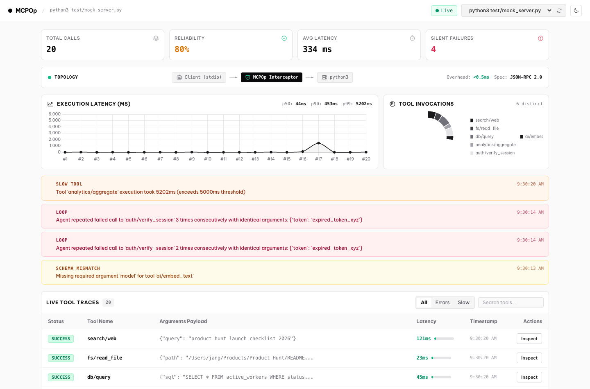

# MCPOp

Transparent observability proxy and silent failure catcher for Model Context Protocol (MCP) servers.



---

## Why this exists

If you use Claude Desktop, Cursor, or autonomous agents with MCP servers, you have likely run into this:

You install a bunch of MCP tools, start a coding session, and suddenly your token budget evaporates while the agent produces garbage output.

Here is what is actually happening under the hood:

1. **The Retry Death Loop:** When an MCP tool fails silently (expired token, database timeout, internal 500), the agent does not just stop. It aggressively retries the exact same broken payload 5 to 10 times in a row. Because every retry re-transmits the entire conversation context window, you burn 50,000+ tokens in 30 seconds for zero result.
2. **Schema Mismatches:** The agent hallucinates arguments or drops a required property. The tool crashes, but because everything runs over background stdio pipes, you see zero logs.
3. **Latency Black Holes:** A sluggish tool (>5s) stalls the agent workflow until the client times out.
4. **Painful Debug Loops:** Testing a single broken tool call used to require restarting Claude Desktop or writing manual stdin test harnesses.

MCPOp sits invisibly between your AI client and your MCP server, records the stdio JSON-RPC traffic, and flags these failures in real time. It does not currently block retries or intercept the call; the dashboard tells you what is happening so you can stop the loop yourself.

---

## What MCPOp does

MCPOp is a single CGO-free Go binary. The proxy forwards each newline-delimited JSON-RPC line immediately, then parses it asynchronously for storage and heuristics.

- **Loop Detection:** Flags consecutive failed tool calls with identical arguments before they spiral into token-burning loops.
- **Real-Time Schema Validation:** Cross-checks argument payloads against the server's `tools/list` schema to immediately pinpoint missing required parameters.
- **Latency Tracking:** Measures execution time per call and flags slow operations exceeding threshold.
- **1-Click Replay:** Includes an embedded, minimalist B&W web dashboard with live trace waterfalls. Inspect any past payload, edit JSON arguments inline, and re-execute the *recorded session command* from your browser. Replay starts only that MCP server; it does not accept a command from the request body.
- **Embedded SQLite and Web UI:** Packaged as a standalone binary with pure-Go SQLite (`modernc.org/sqlite`). No Node.js, Python, or C compiler required to run MCPOp itself.

Traces, including tool arguments, are stored in plaintext at `~/.mcpop/data.db`. Treat that file as sensitive.

---

## Architecture

```
┌────────────────────────────────────────────────────────┐
│ AI Client (Claude Desktop / Cursor / Antigravity)      │
└──────────────────────────┬─────────────────────────────┘
                           │ Stdio JSON-RPC (newline-delimited)
┌──────────────────────────▼─────────────────────────────┐
│ MCPOp Core                                             │
│ ├── Transparent Stdio Pipe Interceptor                 │
│ ├── Async Heuristic Failure Worker                     │
│ │    ├── Retry Loop Catcher (consecutive failures)     │
│ │    ├── Schema Mismatch & Property Validator          │
│ │    └── Latency & Slow Tool Profiler                  │
│ ├── Pure Go SQLite Persistence (~/.mcpop/data.db)      │
│ └── Embedded Web Dashboard (http://127.0.0.1:4040)     │
└──────────────────────────┬─────────────────────────────┘
                           │ Child Subprocess Stdio
┌──────────────────────────▼─────────────────────────────┐
│ Target MCP Server (Python, Node.js, Go, Rust, etc.)    │
└────────────────────────────────────────────────────────┘
```

The dashboard is HTTP + Server-Sent Events. The proxy path itself is stdio only; Content-Length framed MCP is not supported yet.

---

## Quick Start

### 1. Install

Using Go:
```bash
go install github.com/jangtrinh/mcpop/cmd/mcpop@latest
```

Or build from source:
```bash
git clone https://github.com/jangtrinh/mcpop.git
cd mcpop
make build
# Binary is at ./bin/mcpop
```

### 2. Configure with Claude Desktop or Cursor

Prefix your existing MCP server command with `mcpop run --`.

#### Before:
```json
{
  "mcpServers": {
    "sqlite-server": {
      "command": "python",
      "args": ["/path/to/server.py"]
    }
  }
}
```

#### After:
```json
{
  "mcpServers": {
    "sqlite-server": {
      "command": "mcpop",
      "args": ["run", "--", "python", "/path/to/server.py"]
    }
  }
}
```

Open `http://127.0.0.1:4040` to view the live dashboard. The HTTP server binds to localhost by default.

---

## CLI Reference

```bash
# Wrap an MCP server command
mcpop run -- python server.py

# Custom dashboard port
mcpop run --port 8080 -- python server.py

# Bind address (default: 127.0.0.1)
mcpop run --bind 127.0.0.1 -- python server.py

# Custom slow tool threshold (in ms, default: 5000)
mcpop run --slow-threshold 2000 -- node index.js

# Headless mode (no web server, SQLite background logging only)
mcpop run --no-ui -- python server.py

# Open standalone dashboard to view past traces and failures
mcpop dashboard --port 4040

# Print version
mcpop version
```

---

## Development and Testing

```bash
# Run unit tests with the race detector
make test

# Generate realistic mock traffic (20+ tool calls with anomalies)
python3 test/seed_data.py
```

---

## License

MIT License. Free and open source.
